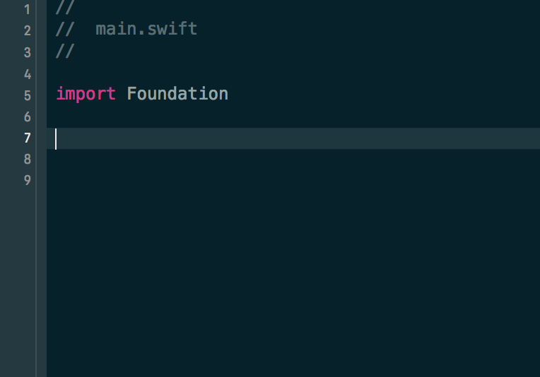

# GCJSwift

---


^ GCJ is "Google Code Jam"
^ Google Code Jam is a programming contest

---

#Solve 1...N problems  
Algorithmic
Google provides input files
Tournament Style


  
^ Algorthims are fun(?)
^ T-Shirts

---

#**Any** Programming Language
#**Any** Text Editor
#**Any** Premade Code!

---

#Cool, but...

---


#WTF?!

^ Google reccomends C++ and Java?
^ What about Swift?

---

>  52 Participants used Swift in 2016

#####**(0.43% of C++)**

^ NOT EVEN 1%
^ Unfortunate
^ A good opportunity to see other solutions
^ A good opportunity to learn

---

# Lets get started

^ Ready to Compete
^ And...

---

#Choose your starting point


^ Pretty nice looking XCode screen
^ I'll choose the editor on the right

---

#GCJSwift

^ I just chose GCJSwift

---

#Would you rather write this

---

```swift
func readFile() {
	let file = "input.in"
	if let dir = FileManager.default.urls(for: .documentDirectory, in: .userDomainMask).first {
    let path = dir.appendingPathComponent(file)
    do {
        let text = try String(contentsOf: path, encoding: String.Encoding.utf8)
    }
    catch {/* ... */}
}
```

^ You can live your life like that

---

#or this?

---

```swift
func makeBatmanMyBestFriend() {
	// ...
}
```

---

#GCJSwift

^ Will not actually make Batman be your best friend
^ ...because we're already BFFs

---

Shortcut to Code

^ Broilerplate
^ No more Boring Parts
^ You, a text editor, and an algorithm
^ And T-Shirts

---

##As a bonus...

^ We didn't think of this until later

---


^ Its a great tool to help teach code
^ Good for interviews

---


##[https://github.com/Keno42/GCJSwiftPackage](https://github.com/Keno42/GCJSwiftPackage)

#####[https://code.google.com/codejam](https://code.google.com/codejam)

^ Access the repository at the above link
^ Codejam link